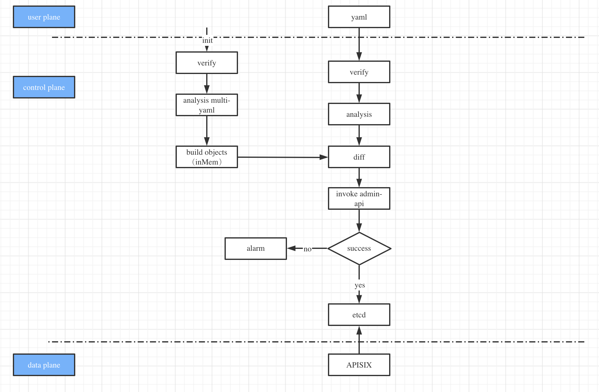

<!--
#
# Licensed to the Apache Software Foundation (ASF) under one or more
# contributor license agreements.  See the NOTICE file distributed with
# this work for additional information regarding copyright ownership.
# The ASF licenses this file to You under the Apache License, Version 2.0
# (the "License"); you may not use this file except in compliance with
# the License.  You may obtain a copy of the License at
#
#     http://www.apache.org/licenses/LICENSE-2.0
#
# Unless required by applicable law or agreed to in writing, software
# distributed under the License is distributed on an "AS IS" BASIS,
# WITHOUT WARRANTIES OR CONDITIONS OF ANY KIND, either express or implied.
# See the License for the specific language governing permissions and
# limitations under the License.
#
-->

# APISIX-CONTROL-PLANE

## What is apisix-control-plane

apisix-control-plane is an implementation of providing a control plane for DPs (Data Plane) like Apache APISIX or other gateways. with a `yaml` configuration capability, We can use `yaml` to define the behavior of any DP.

## Why do we need to implement a control-plane

For now, we have a default implementation for Apache APISIX.

As we know, Apache APISIX is a high-performance gateway. When using APISIX we need to inform APISIX of some proxy rules, and distribute these rules to APISIX modules. We can call it control-plane, similar to pilot in istio. Of course, the distribution configuration is only the most basic function of the control plane.

We know that APISIX already has Admin API, so why do we need to implement a control-plane?

First of all, Apache APISIX Admin API is a way to define a single object, such as a single object such as route / service / upstream / consumer, although it is also possible to completely define a route through a huge route object, and the upstream object is embedded in the route , But any minor changes will trigger the reconstruction of the route. Rebuilding the route is definitely not a good idea and reduce performance.

In fact, leaving aside the Admin API, what we need is a description method that can completely define the rules while maintaining the legibility of the Admin API. Therefore, we have [discussion here](https://github.com/apache/apisix-control-plane/blob/master/doc/yaml_struct.md), and we have implemented a version of the basic functions according to this data structure , I hope everyone puts forward their views. We can also submit a PR to modify this [document](doc/yaml_struct.md).

Secondly, Apache APISIX Admin API uses id associations to strongly bind objects to express the relationship between objects. For example, the route object uses `service_id` and `upstream_id` to bind the relationship with service and upstream respectively.

This kind of representation, like the well-known relational database, is easier to understand and reduces redundant configurations. But it also brings some other problems. For example, rely on verification. When we want to bind an `upstream_id` to a route, we must first create the upstream, and then bind the generated `upstream_id` to the route. This process corresponds to two Admin APIs, and there is no transaction management.

We hope that the emergence of control-plane can solve the above two problems.
1. Use yaml declarative definition method to define complete rules.
2. Block DP implementation details, describe object relationships in a unified way.

Of course, with control-plane we can do more.

For example, based on gitops configuration version management, it is also more convenient to use yaml to define APISIX in k8s.

Realize the prototype of cross-cluster synchronization configuration through the control panel. In the future, we can also enrich the functions of the control plane and simplify management under the cluster mode of multi-platform hybrid deployment (k8s/vm). We can also shield specific implementations of APISIX and provide configuration functions for more types of gateways.

## Feature support

1. Support the declarative definition of yaml.
2. Use the memory database to synchronize the gateway status.
3. Diff capabilities based on memory objects.
4. Sync / update the APISIX configuration.
5. Support incremental synchronization.
6. Support transaction processing.

We created [apache/apisix-control-plane](https://github.com/apache/apisix-control-plane) to provide the basic implementation of the above features.

We also plan to support the following features

1. Support multiple DP configuration.
2. Support pull/push two synchronization strategies.
3. Support multi-DP hybrid cluster.
4. Support migration between DPs.

Everyone is welcome to participate in discussions and contributions.

